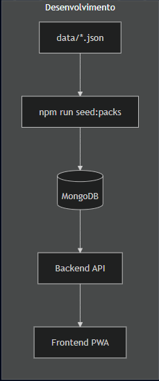

# PartyMix

**Jogos de festa numa só app** — para telemóvel, em grupo, com o telemão na mesa.

PartyMix junta desafios, perguntas, baralhos de beber, cartas e dedução numa experiência única. Serve para animar festas, jantares e encontros sem andares a saltar entre várias apps.

> **Produto proprietário** — código, textos e marca reservados. Não é open source nem está disponível para cópia, instalação local ou redistribuição. Ver [LICENSE](LICENSE) · [PROPRIEDADE.md](PROPRIEDADE.md)

> **Conteúdo:** alguns modos referem álcool ou temas adultos (ex. modo Beber, Casal). Destinado a **maiores de 18 anos**. Bebe com moderação; não é obrigatório beber para jogar — podes adaptar as regras ao grupo.

---

## O que faz

Abres a app no **telemóvel** (versão web, em português), escolhes o modo e jogas. Um telemão na mesa chega na maior parte dos modos; no **Modo Cartas** cada pessoa pode entrar na sala com o seu telemóvel e um código.

O conteúdo (desafios, cartas, baralhos) vem do servidor — não precisas de configurar nada, só de ter internet.

---

## Ecrã principal

---

## Modos de jogo

| Modo | O que inclui |
|------|----------------|
| **Casal** | Dados, desafios, quiz, roleplay e mapa a dois |
| **Amigos** | Mapa, mini-jogos, penalizações e carta Impostor |
| **Família** | Cultura, desporto, música e cinema — tom mais leve |
| **Beber** | Baralho de regras, roleta e contagem de goles |
| **Cartas** | Estilo Cartas Contra Tugas, com sala online |
| **Mister White** | Dedução social — quem é o infiltrado? |
| **Comunidade** | Submetes cartas; as mais votadas entram no jogo |

**Extras:** packs de conteúdo (`base`, temas de festa…), Sabichão, cartas especiais no modo Beber (Agente Secreto, Aliança, Espelho, Mini Boss), IA opcional, **Raspadinha / posição do dia** (modo Casal).

---

## Tecnologias

Visão geral de como a app está construída e onde corre online.

| Camada | O que usamos |
|--------|----------------|
| **Interface** | React, Vite, Tailwind CSS, Framer Motion |
| **Experiência móvel** | App web (PWA) — usas no browser do telemóvel |
| **API** | Node.js, Express |
| **Base de dados** | MongoDB ([Atlas](https://www.mongodb.com/cloud/atlas)) |
| **Tempo real** | Socket.IO (salas de cartas e lobby) |
| **Frontend online** | [Netlify](https://www.netlify.com/) |
| **Backend online** | [Render](https://render.com/) |
| **IA (opcional)** | Groq API — desafios e apoio no admin |
| **Qualidade** | GitHub Actions (verificação e testes automáticos) |

**Em desenvolvimento:** versão para Google Play, contas na cloud e ranking global.

---

## Como o conteúdo chega ao jogo

O conteúdo (frases, cartas, baralhos) está organizado em packs e é servido pela API — assim a app pode receber novos temas de festa sem mudar tudo de uma vez.

---

## Licença

Copyright © 2026 João Magalhães. Todos os direitos reservados.

Desenvolvido por João.
