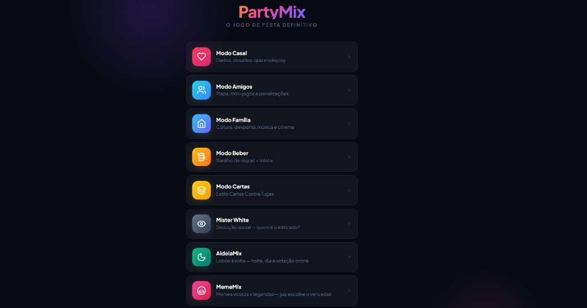
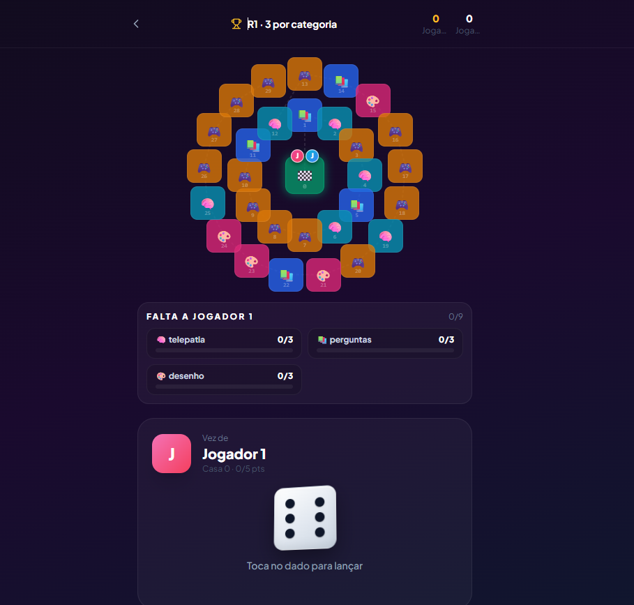
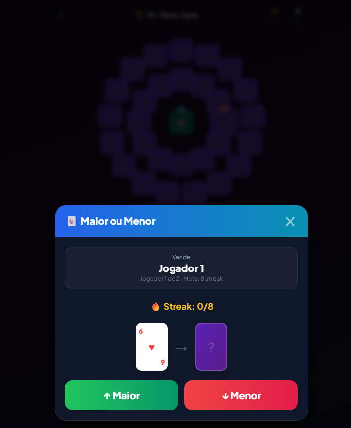
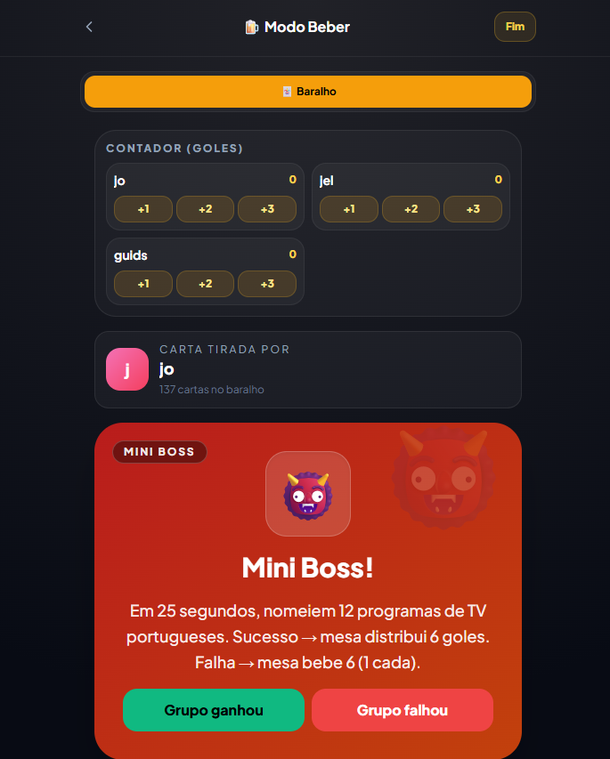

# PartyMix

**Jogos de festa numa só app** — para telemóvel, em grupo, com o telemóvel na mesa.

PartyMix junta desafios, baralhos, cartas, dedução social e modos online numa experiência em **português (PT-PT)**, pensada para festas, jantares e encontros.

> **Conteúdo:** alguns modos referem álcool ou temas adultos. Destinado a **maiores de 18 anos**. Bebe com moderação; podes adaptar as regras ao grupo.

---

## Modos de jogo

### Modo Casal

Para **dois jogadores**. Escolhes a intensidade (Pacífico, Picante ou Hardcore) e depois o que queres fazer:

- **Mapa do Casal** — tabuleiro estilo cobras e escadas, com desafios românticos
- **Dados eróticos** — combina parte do corpo + ação
- **Desafios** — cartas físicas, sensoriais e emocionais
- **Quiz do Casal** — quanto conheces o teu par?
- **Roleplay** — cenários com temporizador
- **Posição do Dia** — raspadinha diária

### Modo Amigos

Jogo de tabuleiro para **2 a 20 jogadores**. Três formas de jogar:

- **Mapa + Categorias** — dado, casas com desafios (Sincronia, Sabichão, Rabiscos, Gestos, Palavra Tabu, Caos) e mini-jogos
- **Só Mini-jogos** — cada casa é um mini-jogo aleatório
- **Só Desafios** — sem mapa, desafios contínuos

Equipas opcionais, penalizações (goles ou penáltis) e carta **Impostor** no baralho Beber.

### Modo Família

Igual ao Amigos em estrutura (mapa, categorias, equipas), mas com tom **mais leve** — sem Caos nem mini-jogos de festa. Ideal para jantares em família ou grupos mistos.

Categorias: Sincronia, Sabichão, Rabiscos, Gestos e Palavra Tabu. Objetivo fixo: **3 pontos por categoria**.

### Modo Beber

Baralho de **137+ cartas** com goles, regras de mesa, missões, duelos e Mini Boss. Inclui baralho **🔗 Cadeia** (nomeia em turno — géneros musicais, bandas, clubes, etc.), **roleta**, contador de goles por jogador e carta Impostor escondida no baralho.

### Modo Cartas

Estilo **Cards Against Humanity** (PT). Cria ou entra numa **sala online com código**; cada jogador no seu telemóvel. Um juiz por ronda escolhe a carta preta, os restantes respondem com brancas — ganha a combinação mais engraçada.

### Mister White

Dedução social: há um **infiltrado** que não sabe a palavra secreta. Dois modos:

- **Um telemóvel** — passa o telemóvel à volta da mesa para ver os papéis
- **Online** — cada um no seu telemóvel, sala com código

### MemeMix

**Online**, até **15 jogadores**. Cada um envia fotos do telemóvel; em cada ronda o juiz escolhe um meme, todos escrevem legendas e o grupo vota. O host define pontos para ganhar, quem pode enviar fotos e se entram memes oficiais.

### AldeiaMix

**Lobos à solta** online, até **15 jogadores**. O narrador não joga — gere noite, dia, discussão e **votação digital**. Reconexão com o mesmo nome. Mínimo 4 na sala (1 narrador + 3 jogadores).

### Comunidade

Submete as tuas cartas (Amigos, Família, Casal ou Beber). A comunidade vota; as mais populares entram nos packs oficiais do jogo.

---

## Licença

Copyright © 2026 João Magalhães. Ver [LICENSE](LICENSE).

Desenvolvido por João.
