

  

<h1 align="center">PartyMix</h1>

  <strong>A festa inteira no telemóvel.</strong> 
  Jogos sociais multiplayer em português de Portugal — um ecrã na mesa, ou cada um no seu.

  
  
  
  
  
  

<em>Alguns modos falam de álcool ou temas adultos. Destinado a maiores de 18 anos — o Modo Família fica disponível para menores.</em>

---

## O que é

O PartyMix é a app que se abre quando a mesa já está cheia e alguém diz «e agora?». Junta baralhos para beber, mapas de desafios, cartas brancas contra pretas, dedução social e legendas de memes — tudo no mesmo sítio, pensado para telemóvel e para grupos de 2 a 15 pessoas.

Não é um catálogo de mini-jogos. É uma noite: escolhes o tom, sentas o grupo, e o telemóvel conduz o ritmo.

  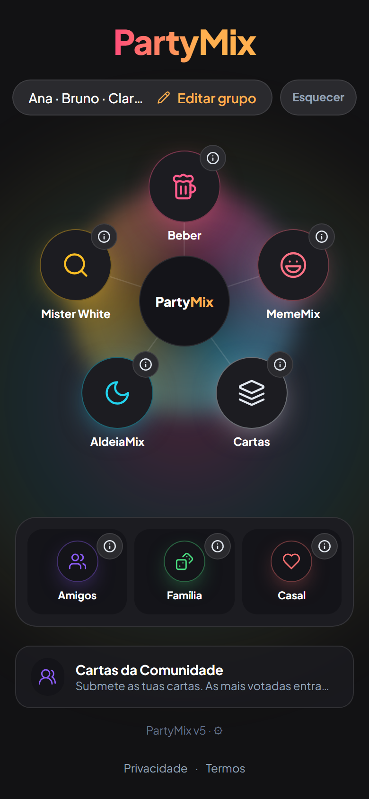

<em>Home — a roda da festa, no ecrã de um telemóvel.</em>

---

## A app em imagens

<table>
  <tr>
    <td align="center" valign="top" width="50%">
      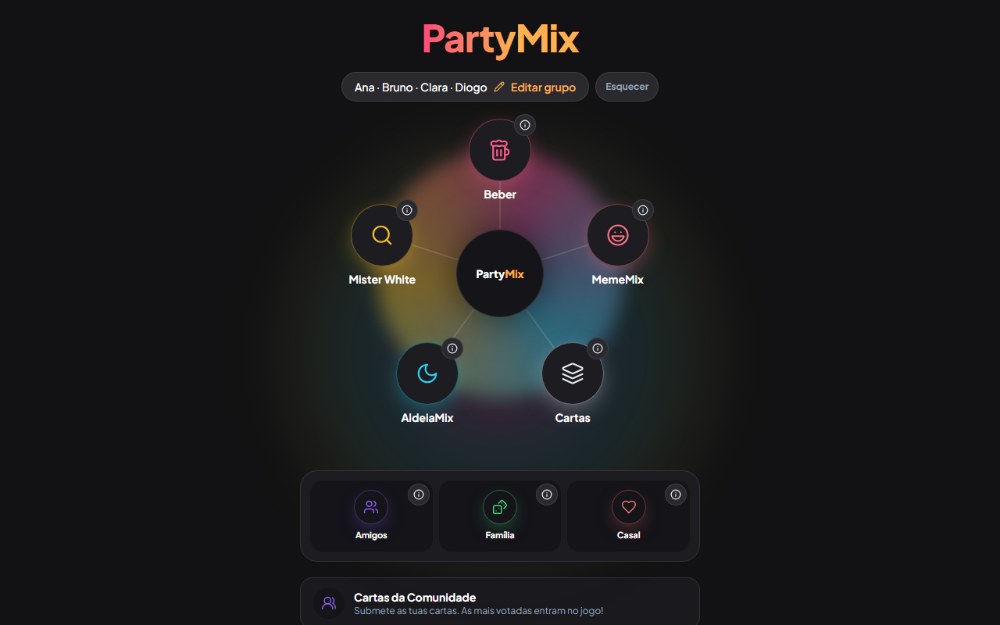
       A mesma Home num ecrã largo — PWA, não é um sítio à parte.
    </td>
    <td align="center" valign="top" width="50%">
      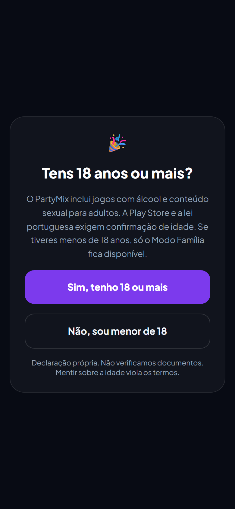
       Confirmação de idade à entrada. Menores só vêem Família.
    </td>
  </tr>
  <tr>
    <td align="center" valign="top">
      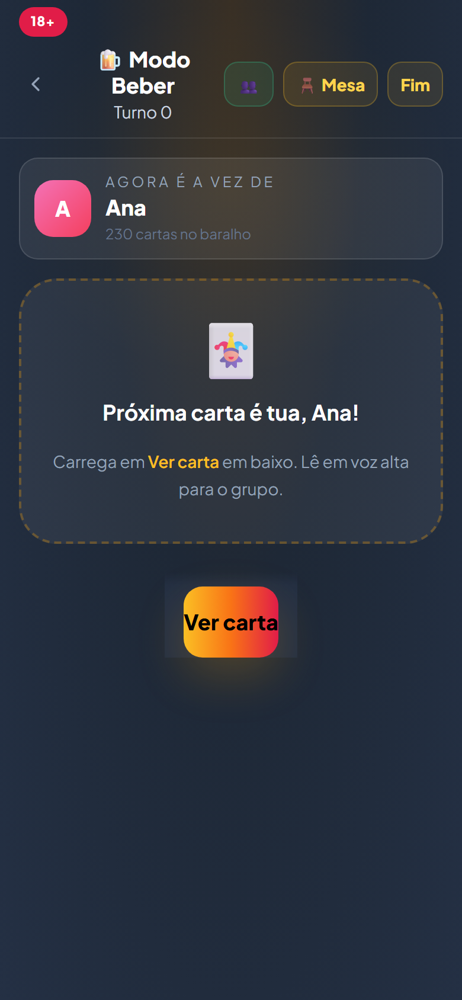
       Beber — um telemóvel na mesa, turno a turno.
    </td>
    <td align="center" valign="top">
      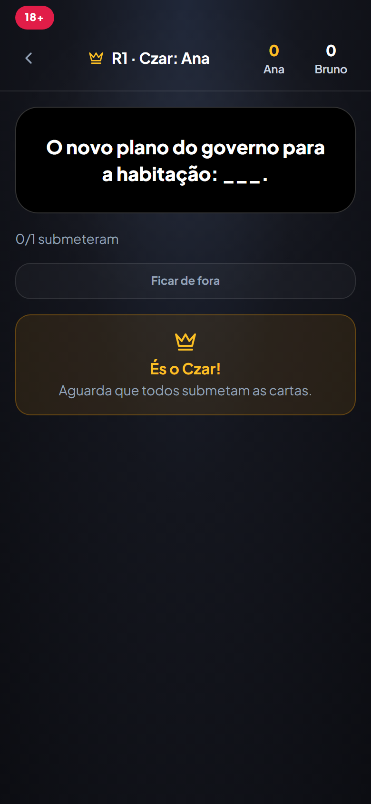
       Cartas — cada um no seu; o czar espera as brancas.
    </td>
  </tr>
  <tr>
    <td align="center" valign="top">
      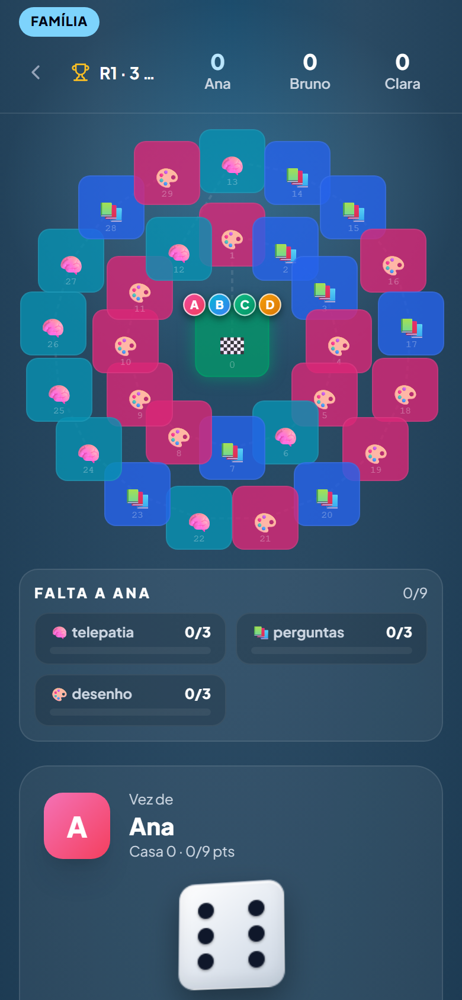
       Família — mapa em espiral, sem álcool nem conteúdo adulto.
    </td>
    <td align="center" valign="top">
      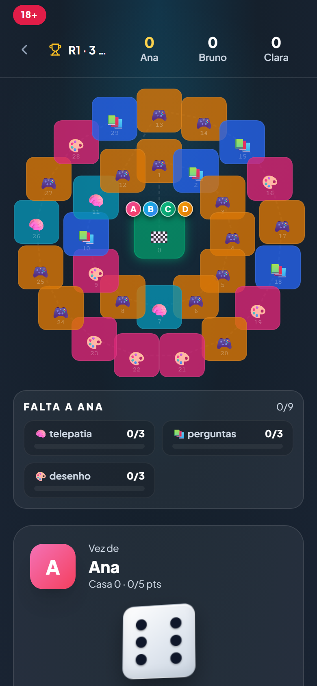
       Amigos — o mesmo mapa, com mini-jogos e casas de festa.
    </td>
  </tr>
  <tr>
    <td align="center" valign="top">
      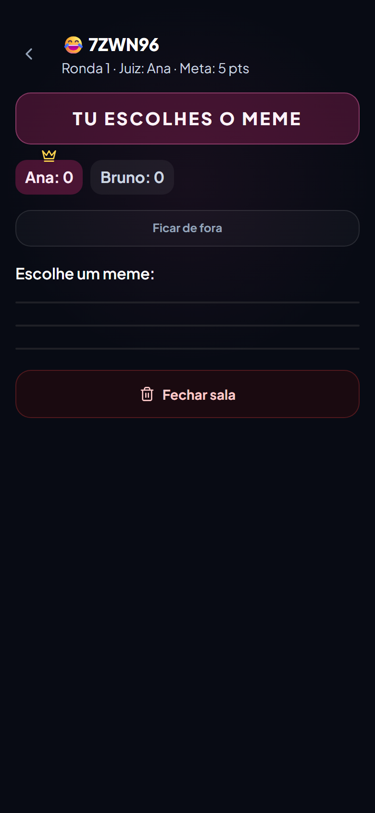
       MemeMix — o juiz escolhe o meme da ronda.
    </td>
    <td align="center" valign="top">
      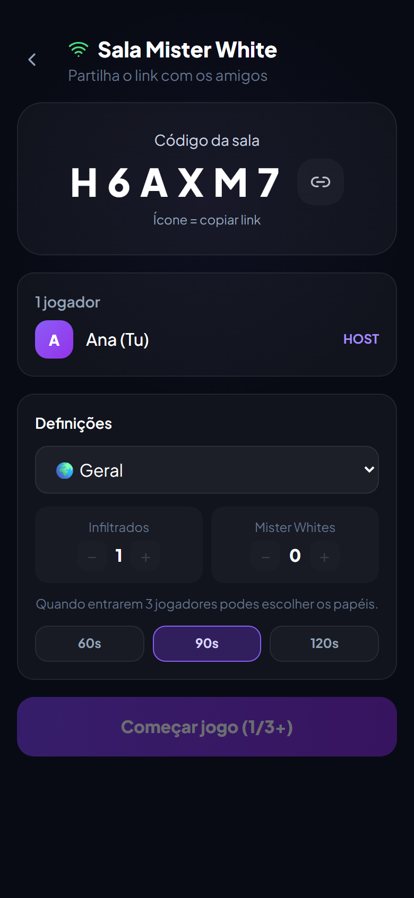
       Mister White — sala com código, papéis e timer.
    </td>
  </tr>
</table>

---

## Modos de jogo

### Beber

Um telemóvel no centro da mesa. Packs misturáveis (centenas de cartas), categorias que se ligam e desligam, e uma sessão que sobe de ritmo à medida que o baralho vai acabando.

  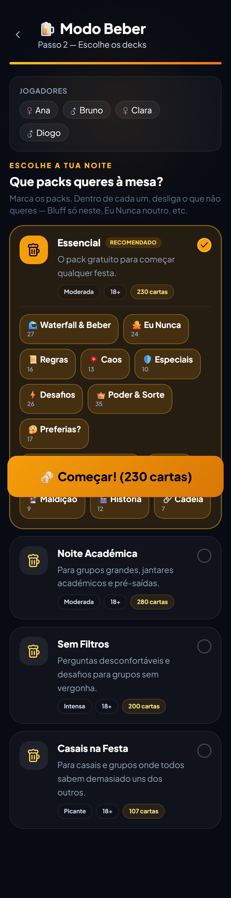

<em>Quatro noites à escolha — Essencial, Noite Académica, Sem Filtros, Casais na Festa.</em>

### Família

A estrutura dos Amigos (mapa, categorias, equipas), com o tom certo para um jantar: Sincronia, Sabichão, Rabiscos, Gestos e Palavra Tabu. Sem álcool, sem Caos, sem mini-jogos de festa.

### Amigos

Dado, casas com desafios e mini-jogos. Três formas de jogar — mapa com categorias, só mini-jogos, ou só desafios. Equipas opcionais; penalizações em goles ou penáltis.

  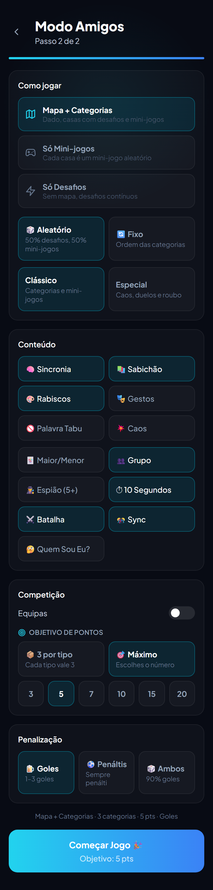

<em>Como jogar, categorias e mini-jogos — tudo no telemóvel da mesa.</em>

### Casal

Dois jogadores. Escolhem a intensidade (Pacífico, Picante ou Hardcore) e o que entra na noite: mapa, desafios, quiz, roleplay. O ecrã abaixo fica no seletor — sem conteúdo explícito.

  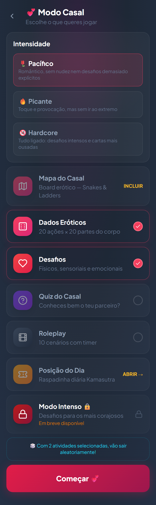

<em>Modo Casal — o grupo define o tom antes de qualquer carta.</em>

### Cartas

Estilo cartas pretas / brancas, em português. Cada jogador no seu telemóvel; o host cria a sala, partilha o código ou o link, e um czar por ronda escolhe a combinação. Dá para ficar de fora sem sair da sala.

<table>
  <tr>
    <td align="center" valign="top" width="50%">
      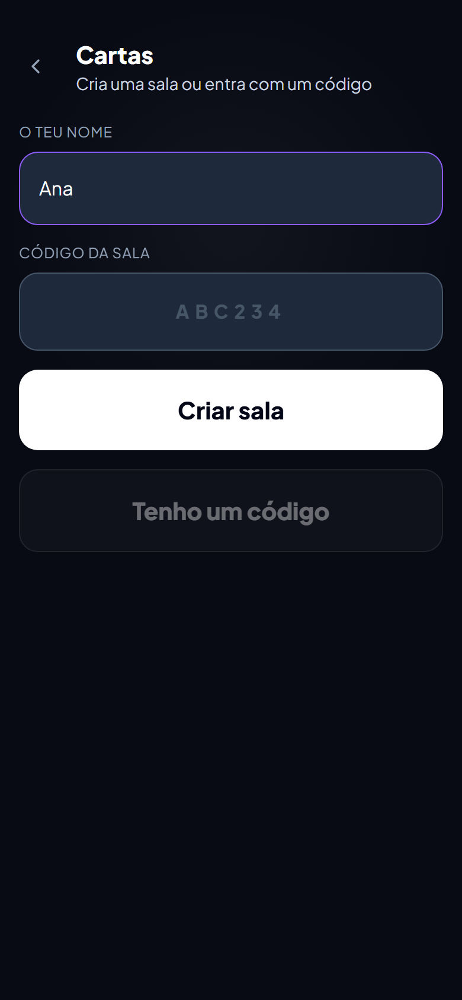
       Nome + código — criar ou juntar-se.
    </td>
    <td align="center" valign="top" width="50%">
      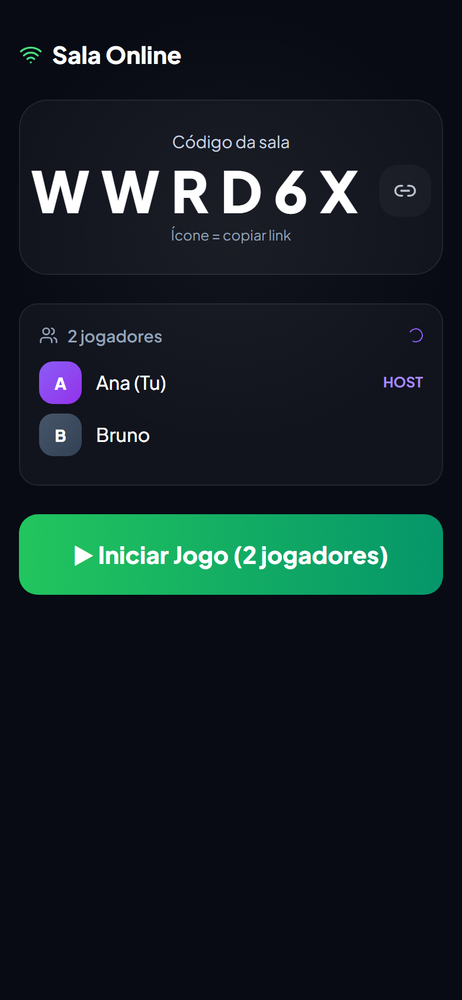
       Sala online: código, lista e host a iniciar.
    </td>
  </tr>
</table>

### MemeMix

Até 15 jogadores. Cada um manda fotos da festa; o juiz escolhe o meme, os outros jogam legendas do pack ou escritas na hora, e o grupo vota. Fotos comprimidas no telemóvel, consentimento à vista, sala que se apaga no fim.

  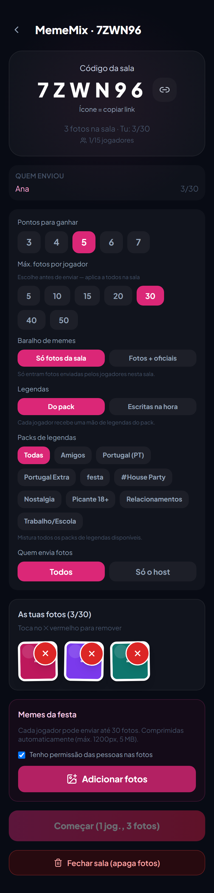

<em>Lobby MemeMix — pontos, packs de legendas e fotos da sala.</em>

### Mister White

Há um infiltrado que não sabe a palavra. Dois caminhos: um telemóvel a circular na mesa, ou sala online em que cada um só vê o seu papel. O host conduz a discussão e as eliminações.

  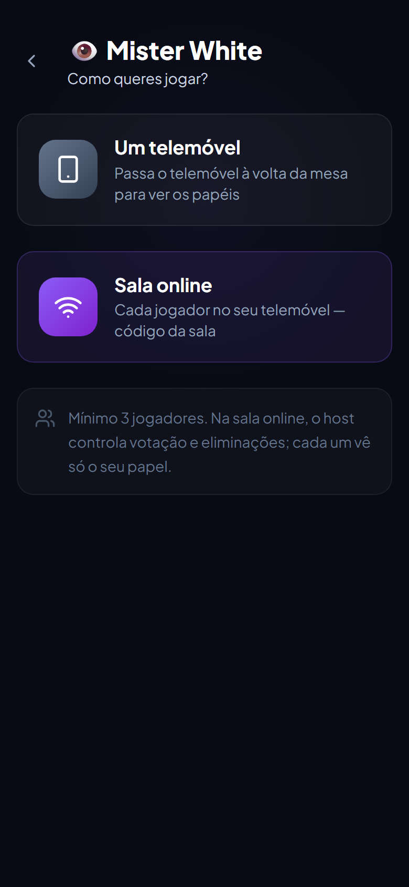

<em>Local ou online — a mesma dedução, dois jeitos de sentar a mesa.</em>

### AldeiaMix

Lobos, noite e votação digital. O narrador não joga: conduz a ronda. Cada um no seu telemóvel; quem cai e volta entra com o mesmo nome.

  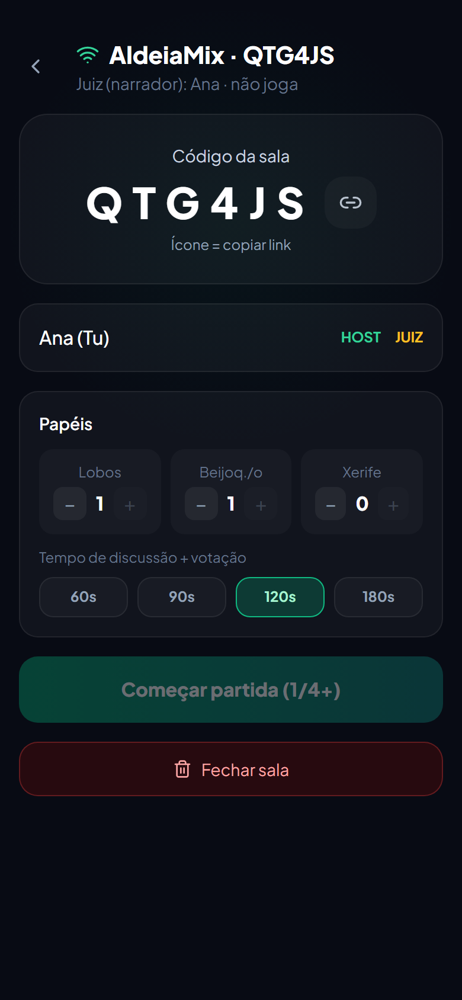

<em>Sala AldeiaMix — papéis, tempo de discussão e juiz à parte.</em>

### Comunidade

Os jogadores submetem cartas (Amigos, Família, Casal, Beber, Cartas, legendas). A mesa vota; as que sobem entram nos packs oficiais.

---

## Stack

| Camada | Tecnologia |
| --- | --- |
| Interface | React 18, Vite, Tailwind CSS, Framer Motion |
| Tempo real | Socket.IO |
| API | Node.js, Express |
| Dados | MongoDB / Mongoose |
| App | PWA (instalável no ecrã inicial, iOS e Android) |
| IA | Groq no servidor — desafios surpresa e geração de cartas |

O cliente é uma SPA pensada para o polegar. O servidor segura salas, conteúdo e idade; a chave de IA nunca sai do backend.

---

## Decisões que importam

- **Salas em tempo real, não um chat com dados.** Cartas, MemeMix, Mister White e AldeiaMix correm em Socket.IO: código de 6 caracteres, papel de host, reconexão pelo nome e *sit-out* sem largar o socket — o telemóvel cai, a cadeira fica.
- **Um produto, dois tipos de mesa.** Beber, Família, Amigos e Casal partilham um telemóvel. Cartas, MemeMix e AldeiaMix pedem um ecrã por pessoa. A Home deixa isso explícito sem um tutorial.
- **Conteúdo como sistema, não como ficheiro único.** Packs em JSON, baralhos na base, votos da comunidade e um *age gate* que esconde modos adultos. A curva do Beber muda com o que ainda falta no baralho — o fim da noite não joga igual ao início.
- **Telemóvel a sério.** `viewport-fit`, *safe areas*, `dvh` em vez de `100vh`, inputs a 16px para o Safari não fazer zoom. A mesma UI no Chrome Android e no Safari iOS.
- **IA com cerca.** Geração de desafios e cartas passa pelo servidor (Groq), com listas de nomes fechadas e filtros de segurança. O cliente só pede o resultado.

---

  © 2026 João Magalhães · PartyMix · projecto próprio

